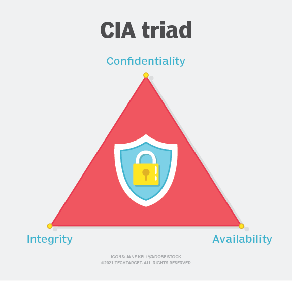
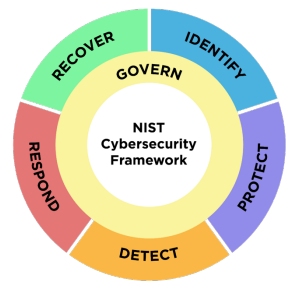

# Conceitos Básicos

## Segurança e Cibersegurança

A segurança em geral envolve a **proteção** de **ativos** contra diversas **ameaças** representadas por **vulnerabilidades** inerentes. Os processos de segurança geralmente tratam da implementação de mecanismos de segurança (também chamados de **contramedidas**) que ajudam a reduzir o **risco** representado por essas vulnerabilidades.

Cibersegurança é a proteção de todos os ativos que podem ser alcançados pelo **ciberespaço**. O que engloba sistemas de computadores, informações armazenadas ou em trânsito, dispositivos e os usuários destas tecnologias.

Para um ativo ser definido como protegido alguns atributos devem ser mantidos, são estes:

* Confidencialidade
  * Um ativo não pode ser acessado por uma entidade não autorizada.
* Integridade
  * Um ativo não pode ser alterado por uma entidade não autorizada.
* Disponibilidade
  * O acesso a um ativo não pode ser impossibilitado por terceiros.

Estes atributos são conhecidos como a tríade CIA (Confidentiality, Integrality, Availability) sendo um modelo designado a guiar as politicas de cibersegurança de uma organização.

Definições mais recentes argumentam que a tríade precisa de novos atributos, dessa forma, adicionam outras características como:

* Autenticidade
  * Um ativo deve conseguir comprovar sua legitimidade e origem.
* Não repúdio
  * Uma entidade não pode negar a autoria de uma ação ou posse de um ativo.

## Padrões de Cibersegurança

Organizações internacionais, como a International Organization for Standardization (ISO) e o National Institute of Standards and Technology (NIST), desempenham um papel fundamental no desenvolvimento de padrões e diretrizes amplamente reconhecidos na comunidade de cibersegurança. Esses padrões frequentemente convergem em princípios fundamentais, processos e boas práticas, fornecendo um alicerce robusto para a segurança cibernética.

O NIST, uma agência federal dos Estados Unidos, é uma referência na produção de padrões e diretrizes para diversas áreas, com destaque para a cibersegurança. Seus documentos orientativos são vitais para organizações que buscam fortalecer sua postura de segurança.

Um exemplo notável é o NIST Cybersecurity Framework (CSF), uma estrutura aberta e baseada em princípios, desenvolvida em resposta à crescente necessidade de orientações comuns entre organizações para o gerenciamento de riscos cibernéticos. O CSF proporciona uma linguagem compartilhada para compreender e comunicar práticas de gestão de riscos cibernéticos.

O CSF é estruturado em cinco funções principais, cada uma centrada em uma área crítica de foco:

1. **Identify (Identificar):** Desenvolver uma compreensão das atividades, ativos e recursos críticos para a organização.
2. **Protect (Proteger):** Implementar salvaguardas para assegurar a entrega segura dos serviços essenciais.
3. **Detect (Detectar):** Desenvolver e implementar atividades de monitoramento e detecção para identificar incidentes de segurança.
4. **Respond (Responder):** Desenvolver e implementar planos de resposta a incidentes para lidar eficazmente com eventos de segurança.
5. **Recover (Recuperar):** Desenvolver e implementar planos de recuperação para restaurar as operações normais após um incidente.

A versão 2.0 do framework, lançada em agosto de 2023, introduziu a governança como uma nova função crítica que abrange todo o processo. O documento completo pode ser acessado em: https://doi.org/10.6028/NIST.CSWP.29.ipd

## Tipos Comuns de Ameaças

Uma ameaça, no contexto da cibersegurança, pode ser definida como qualquer circunstância ou evento com o potencial de comprometer a confidencialidade, integridade ou disponibilidade de um ativo. Essas ameaças se materializam na forma de ataques — ações deliberadas ou acidentais que exploram vulnerabilidades — e representam um componente fundamental do modelo de risco. A correta identificação e categorização das ameaças é um passo essencial para a construção de políticas de segurança.

Entre as ameaças mais recorrentes, destacam-se:

**1. Malware (Malicious Software)**\
O termo "malware" abrange qualquer software desenvolvido com a intenção de causar danos a um sistema, comprometer dados ou obter acesso não autorizado. Ele se manifesta em diversas formas:

* _Vírus_ replicam-se inserindo seu código em arquivos legítimos e requerem a execução do hospedeiro para ativação.
* _Worms_ são autônomos e capazes de se propagar automaticamente por redes, explorando falhas de configuração ou software.
* _Trojans_ disfarçam-se de aplicações legítimas para induzir o usuário a executá-los, abrindo portas para controle remoto, espionagem ou instalação de payloads adicionais.
* _Ransomware_ encripta dados do usuário e exige pagamento para liberação, sendo uma das ameaças mais disruptivas e financeiramente lucrativas da atualidade.
* _Spyware_ monitora discretamente as atividades do usuário, coletando informações sensíveis, como credenciais, hábitos de navegação e comunicações.

**2. Engenharia Social**\
Ataques de engenharia social exploram vulnerabilidades humanas, manipulando vítimas a divulgar informações sensíveis ou realizar ações prejudiciais.

* _Phishing_ é a forma mais comum e envolve comunicações fraudulentas (geralmente e-mails) que induzem o usuário a clicar em links maliciosos ou enviar credenciais.
* _Spear Phishing_ é uma versão direcionada, frequentemente customizada com dados pessoais obtidos de redes sociais ou vazamentos anteriores.
* _Pretexting_ e _baiting_ criam cenários falsos para induzir confiança, geralmente fingindo ser uma autoridade ou oferecendo algo de interesse da vítima.

**3. Ataques de Negação de Serviço (DoS e DDoS)**\
Esses ataques têm como objetivo esgotar os recursos de um sistema (como largura de banda, memória ou capacidade de processamento), tornando-o indisponível para usuários legítimos.

* _DoS_ (Denial of Service) utiliza uma única origem para sobrecarregar o alvo.
* _DDoS_ (Distributed Denial of Service) amplia o ataque ao empregar múltiplas máquinas (frequentemente dispositivos zumbis controlados via botnets), o que dificulta a mitigação e o rastreamento.

**4. Ataques de Injeção e Execução Remota**\
Esses ataques exploram falhas em aplicações para introduzir comandos ou scripts maliciosos:

* _SQL Injection_ permite ao atacante manipular consultas a bancos de dados, comprometendo a integridade dos dados e, em alguns casos, obtendo controle sobre o servidor.
* _Command Injection_ insere comandos diretamente em chamadas do sistema operacional.
* _Remote Code Execution (RCE)_ ocorre quando um atacante consegue executar código arbitrário remotamente em um sistema vulnerável.

**5. Ataques Baseados em Rede**\
Incluem diversas técnicas de interceptação, falsificação e manipulação de tráfego:

* _Sniffing_ captura pacotes de dados em trânsito em redes desprotegidas.
* _Spoofing_ falsifica identificadores como endereços IP, MAC ou domínios DNS para enganar sistemas e usuários.
* _Man-in-the-Middle (MitM)_ posiciona o atacante entre duas entidades legítimas, permitindo interceptar, modificar ou registrar comunicações em tempo real.

**6. Exploração de Vulnerabilidades Zero-Day**\
Refere-se à exploração de falhas desconhecidas pelos fornecedores ou pela comunidade de segurança. Como ainda não há correções ou assinaturas para tais falhas, esses ataques tendem a ser altamente eficazes e difíceis de detectar. A resposta a essas ameaças exige capacidade de detecção comportamental e inteligência de ameaças atualizada.

**7. Ameaças Internas (Insider Threats)**\
Ameaças internas são causadas por indivíduos com acesso legítimo aos sistemas — empregados, ex-funcionários, contratados ou parceiros. Elas podem ser intencionais (exfiltração de dados, sabotagem) ou acidentais (uso indevido de credenciais, negligência). São particularmente perigosas porque muitas vezes passam despercebidas pelos mecanismos tradicionais de segurança perimetral.

## Áreas da Cibersegurança

A cibersegurança, por sua natureza interdisciplinar, abrange um conjunto diverso de áreas técnicas, cada uma responsável por proteger diferentes aspectos. Essas áreas podem ser vistas como domínios de atuação especializados, frequentemente sobrepostos, que compõem o ecossistema da defesa cibernética. A seguir, descrevemos as principais áreas:

### Segurança da Informação

A Segurança da Informação enfatiza a proteção da informação em todos os seus estados (em repouso, em trânsito e em uso), independentemente do meio. Ela abrange a proteção de dados sensíveis da organização, incluindo informações confidenciais, registros de clientes e propriedade intelectual. A área se apoia fortemente em normas e políticas institucionais, análise de riscos, classificação de informações e conformidade com legislações como a LGPD ou o GDPR.

### Segurança Ofensiva

A Segurança Ofensiva representa o lado proativo e exploratório da cibersegurança, cujo foco é identificar e explorar vulnerabilidades em sistemas para fortalecer a defesa. Técnicas como testes de penetração (pentesting), avaliações de vulnerabilidade, e simulações de ataques avançados (red teaming) são utilizados para encontrar falhas que poderiam ser exploradas por agentes maliciosos. Profissionais desta área combinam conhecimentos profundos de sistemas operacionais, redes, protocolos, engenharia reversa e técnicas de exploração para atuar como hackers. A segurança ofensiva ajuda a priorizar vulnerabilidades conforme o risco e impacto potencial, proporcionando informações valiosas para o aprimoramento das defesas. Além disso, ela contribui para a elaboração de cenários de ameaças realistas e o desenvolvimento de estratégias de mitigação mais efetivas.

### Segurança de Redes

A Segurança de Redes concentra-se na proteção da infraestrutura de rede, abrangendo dispositivos, protocolos e tráfego de dados. Profissionais dessa área implementam medidas como firewalls, redes privadas virtuais (VPNs) e sistemas de detecção e prevenção de intrusões (IDS/IPS) para garantir uma comunicação segura. A segurança de redes também inclui práticas como gestão de perímetro, hardening de dispositivos de borda (roteadores, switches) e detecção de tráfego anômalo.

### Segurança de Sistemas

A Segurança de Sistemas visa proteger servidores, sistemas operacionais e softwares em execução, assegurando sua configuração segura, aplicação de patches, monitoramento contínuo de logs e gestão das contas de usuário. O objetivo é mitigar riscos decorrentes de vulnerabilidades conhecidas e garantir a continuidade e integridade dos serviços.

### Segurança em Nuvem

Trata da adaptação dos princípios tradicionais de segurança aos modelos de serviço e implantação em nuvem (IaaS, PaaS, SaaS). Os desafios incluem o controle de acesso federado, a visibilidade reduzida, o isolamento de recursos e a responsabilidade compartilhada entre provedor e cliente. Ferramentas como CASB (Cloud Access Security Broker), gerenciamento de identidade federada (IAM), e criptografia em trânsito/repouso são fundamentais nesse contexto.

### Desenvolvimento Seguro

O Desenvolvimento Seguro é uma área que permeia todo o ciclo de vida do software, visando garantir que aplicações e sistemas sejam projetados, implementados e mantidos com um foco explícito na segurança. Isso implica a incorporação de práticas como análise de requisitos de segurança desde as fases iniciais, modelagem de ameaças para identificar possíveis pontos vulneráveis, realização contínua de revisões e testes de segurança, como testes estáticos (Static Application Security Testing - SAST) e dinâmicos (Dynamic Application Security Testing - DAST), além do uso de ferramentas automatizadas para detectar vulnerabilidades conhecidas. Um desenvolvimento seguro também exige a adoção de princípios como o princípio do menor privilégio, defesa em profundidade, e validação rigorosa de entradas para mitigar ataques de injeção e outras ameaças comuns. O objetivo final é reduzir a superfície de ataque e minimizar a probabilidade de exploração, antes mesmo da aplicação entrar em produção.

### Forense Digital

A Forense Digital é um campo especializado que aplica técnicas investigativas e analíticas para coletar, preservar, analisar e apresentar evidências digitais relacionadas a incidentes cibernéticos, crimes digitais ou disputas legais.

### Gestão de Identidade e Acesso (Identity and Access Management - IAM)

A Gestão de Identidade e Acesso (IAM) é responsável por garantir que apenas entidades autorizadas possam acessar recursos específicos, e que esse acesso seja apropriado, monitorado e auditável. IAM envolve um conjunto de políticas, processos e tecnologias que facilitam a criação, manutenção e revogação das identidades digitais dos usuários, dispositivos e serviços. Componentes dessa área incluem mecanismos de autenticação, que podem variar de senhas tradicionais a métodos mais avançados, como autenticação multifator (MFA) e autenticação baseada em biometria. A autorização controla os privilégios e permissões, assegurando o princípio do menor privilégio. Além disso, IAM abarca o provisionamento automatizado de contas, gerenciamento de ciclo de vida de identidade, e monitoramento contínuo para detectar acessos anômalos. Em ambientes modernos, especialmente na nuvem, IAM também lida com identidades federadas e Single Sign-On (SSO), integrando múltiplos domínios de segurança e facilitando a experiência do usuário sem comprometer a segurança.

### Criptografia

A Criptografia é uma disciplina especializada na prática de converter dados ou informações legíveis em um formato ilegível por meio de algoritmos e chaves. Seu principal objetivo é garantir que apenas partes autorizadas possam acessar e compreender a informação original. A criptografia é essencial para proteger dados confidenciais em transações financeiras, comunicações sensíveis e informações pessoais, evitando o acesso de terceiros não autorizados. Suas aplicações são vastas e estão integradas em muitos aspectos da cibersegurança e da privacidade digital.

### **Segurança Operacional e Resposta a Incidentes**

Foca na detecção, resposta e recuperação de eventos de segurança. Essa área engloba a operação de Security Operation Centers (SOCs), uso de soluções de monitoramento como SIEM (Security Information and Event Management), e a elaboração de playbooks para resposta a incidentes.

### Governança, Risco e Conformidade (GRC)

GRC integra práticas que asseguram que os objetivos de segurança estejam alinhados às estratégias organizacionais, que os riscos estejam sendo gerenciados, e que todas as normas aplicáveis estejam sendo cumpridas. Envolve auditoria, métricas de desempenho, políticas internas e frameworks como ISO/IEC 27001, NIST SP 800-53 e COBIT.

## **Hackers**

Leia o artigo [Tipos de Hacker](tipos-de-hacker.md) para entender melhor sobre o termo e os diferentes tipos de hackers existentes.
